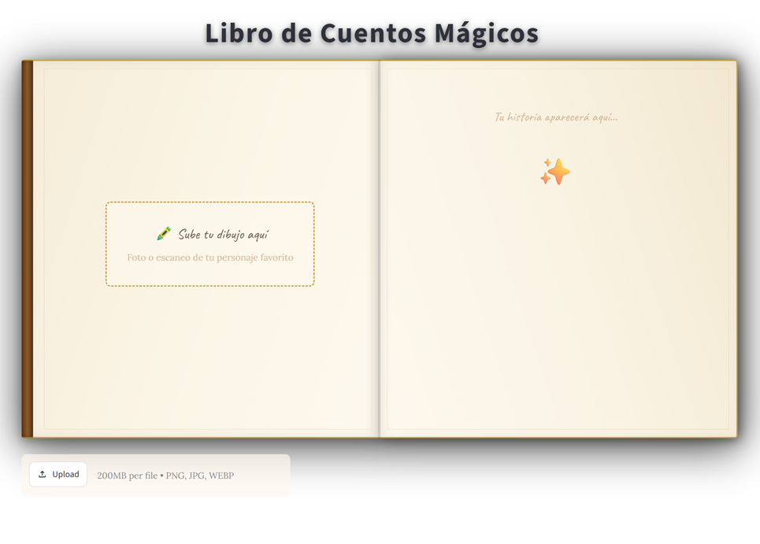
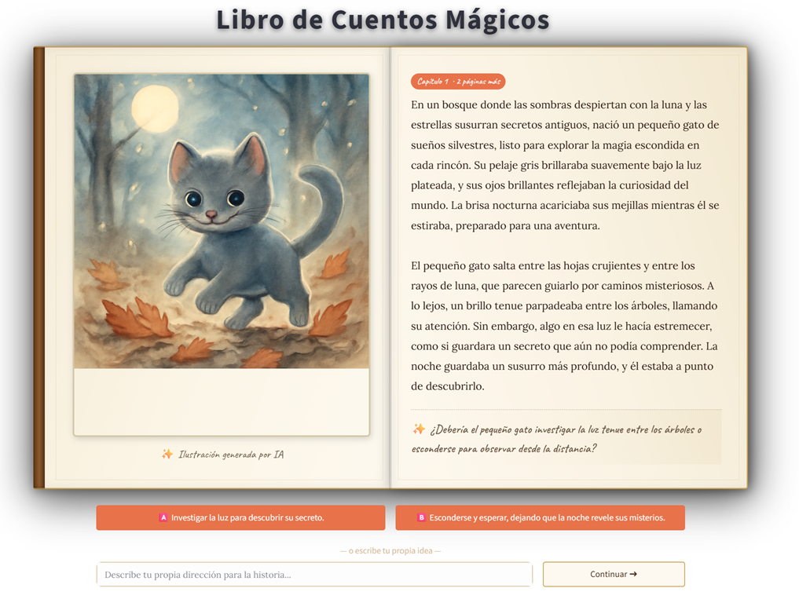

# Cuentos Mágicos con IA


Aplicación de **Generative UI** donde el dibujo de un niño se convierte en
el protagonista de un cuento interactivo generado por IA, con texto en
streaming e ilustraciones generadas en momentos clave de la historia.

---

## 🎯 Resumen 

Proyecto full-stack de IA generativa construido para demostrar cómo diseñar
un producto de IA **listo para producción**, no solo un notebook con una
llamada a la API. Puntos clave:

- **Multi-modelo y multi-modal por diseño**: combina un LLM con visión
  (análisis de imagen), un LLM de texto en streaming (narrativa) y un
  modelo de generación de imágenes (ilustraciones), orquestados en un
  único flujo coherente.
- **Arquitectura desacoplada de proveedores**: el negocio nunca conoce
  a Gemini, OpenAI o Hugging Face directamente — solo interfaces
  (`Protocol`/`ABC`). Cambiar de proveedor gratuito a uno de pago es una
  variable de entorno, no un refactor. Esto es el mismo patrón (*Strategy*
  + *Factory*) que se usa en sistemas productivos para evitar vendor
  lock-in y controlar costes.
- **Control de costes explícito**: la lógica de negocio (`CheckpointController`)
  limita activamente cuántas imágenes se generan por sesión (máx. 3),
  algo que en un producto real de IA es tan importante como la funcionalidad
  misma.
- **UX conversacional en tiempo real**: streaming de texto token a token
  sobre Streamlit, con estado de sesión persistente y manejo de contexto
  narrativo (`ContextManager`) para mantener coherencia entre turnos.
- **Prompts como configuración**: los prompts viven en `prompts/*.txt`,
  fuera del código, para poder iterarlos sin desplegar.
- **Código testeado**: incluye tests unitarios (`tests/`) para la lógica
  de negocio crítica (checkpoints), y está containerizado con Docker
  para despliegue reproducible.

**Stack**: Python · Streamlit · OpenAI (GPT-4o / gpt-image-1) · Google
Gemini · Hugging Face Inference API · Docker · uv/pip.

---

## Flujo de la aplicación

1. **Subida del dibujo** — el usuario sube una foto/escaneo de un dibujo.
2. **Análisis del personaje** — un LLM con visión describe al personaje.
3. **Apertura de la historia** — se genera en streaming el inicio del
   cuento junto con la primera ilustración.
4. **Turnos interactivos** — el usuario elige cómo continúa la historia
   en cada checkpoint; la continuación se genera en streaming.
5. **Cierre** — tras los turnos configurados, se genera el final del
   cuento y la última ilustración.

La aplicación usa **como máximo 3 imágenes** por historia para mantener
los costes bajo control.

## Capturas

| Subida del dibujo | Historia interactiva |
|---|---|
|  |  |

## Arquitectura

El proyecto sigue una arquitectura por capas con **inversión de
dependencias**: la lógica de negocio (`core/`) depende solo de
interfaces abstractas (`providers/base.py`), nunca de un SDK concreto.
Un **factory** (`providers/factory.py`) lee variables de entorno y
decide en tiempo de ejecución qué implementación instanciar — el resto
del código no se entera del cambio.

```
                     ┌──────────────────┐
                     │      app.py      │   UI (Streamlit) + orquestación
                     └────────┬─────────┘
                              │ usa
                     ┌────────▼─────────┐
                     │      core/       │   Lógica de negocio pura
                     │ ─────────────────│
                     │ character_analyzer   → describe el dibujo
                     │ story_generator       → apertura/continuación/cierre
                     │ context_manager       → historial narrativo coherente
                     │ checkpoint_controller → turnos, límite de imágenes
                     └────────┬─────────┘
                              │ depende de interfaces
                     ┌────────▼─────────┐
                     │  providers/base.py│  BaseLLMProvider / BaseImageProvider
                     └────────┬─────────┘
                              │ factory.py instancia según .env
              ┌───────────────┼────────────────┐
     ┌────────▼──────┐ ┌──────▼───────┐ ┌───────▼────────┐
     │ GeminiProvider │ │ OpenAIProvider│ │ HuggingFace /   │
     │  (LLM, gratis) │ │ (LLM+imagen)  │ │ Pollinations    │
     │                │ │               │ │ (imagen, gratis)│
     └────────────────┘ └───────────────┘ └────────────────┘
```

- `app.py` — interfaz Streamlit y orquestación del flujo completo.
- `providers/` — abstracción de LLM e imagen; cada proveedor implementa
  `BaseLLMProvider` (`analyze_image`, `stream_story`) y/o
  `BaseImageProvider` (`generate_image`). Swap de proveedor = cambiar
  `LLM_PROVIDER` / `IMAGE_PROVIDER` en `.env`, sin tocar `core/`.
- `core/` — reglas de negocio: generación de la historia, gestión del
  contexto conversacional y control de checkpoints (cuándo pedir
  decisiones al usuario, cuándo generar imagen, cuándo cerrar la
  historia).
- `prompts/` — plantillas de prompt editables sin tocar código
  (análisis de personaje, apertura, continuación, conclusión, sistema).
- `utils/` — helpers de manejo de imagen y de streaming de texto.
- `tests/` — pruebas unitarias de la lógica de negocio.

### Proveedores soportados

| Rol   | Proveedores disponibles                    | Variable de entorno |
|-------|---------------------------------------------|----------------------|
| LLM   | Gemini (gratis) · OpenAI GPT-4o              | `LLM_PROVIDER`       |
| Imagen| Hugging Face (gratis) · Pollinations (gratis) · OpenAI gpt-image-1 | `IMAGE_PROVIDER` |

## Setup

### 1. Clonar e instalar dependencias

```bash
cd storybook_ai
python -m venv venv
source venv/bin/activate  # En Windows: venv\Scripts\activate
pip install -r requirements.txt
```

### 2. Configurar variables de entorno

```bash
cp .env.example .env
```

Edita `.env` y completa tus claves:

```env
LLM_PROVIDER=openai
IMAGE_PROVIDER=openai

GEMINI_API_KEY=tu_key_aqui   # opcional cuando no se tiene OpenAI
OPENAI_API_KEY=tu_key_aqui
```

### 3. Ejecutar la aplicación

```bash
streamlit run app.py
```

Abre el navegador en `http://localhost:8501`.

### Con uv

```bash
uv sync
uv run streamlit run app.py
```

### Con Docker

```bash
docker build -t storybook-ai .
docker run -p 8501:8501 --env-file .env storybook-ai
```

## Notas técnicas

- El historial de conversación (`ContextManager`) se mantiene completo
  durante toda la sesión, garantizando coherencia narrativa.
- Las ilustraciones incluyen siempre la descripción del personaje
  original en el prompt, para mantener consistencia visual.
- No hay autenticación de usuario; cada sesión de Streamlit es
  independiente (`st.session_state`).
